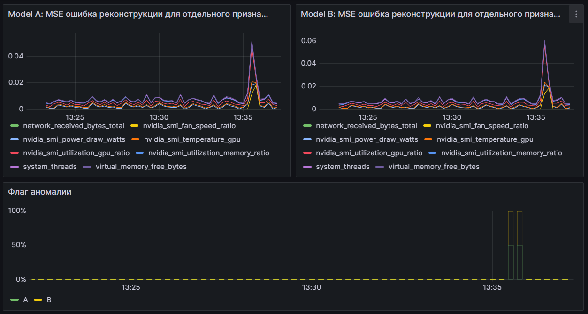

# Prometheus Time Series Anomaly Detection with LSTM Autoencoder

This project implements a system for detecting anomalies in time series data collected from Prometheus. It uses an LSTM (Long Short-Term Memory) autoencoder model built with TensorFlow/Keras to learn normal patterns from your metrics and identify deviations. The system includes scripts for data collection, preprocessing, model training, data filtering, and real-time anomaly detection, exposing results via a Prometheus exporter.

## Features

* **Data Collection:** Fetches time series data from a Prometheus instance for specified PromQL queries. The resulting dataset contains `day_of_week` and `hour_of_day` columns derived from timestamps.
* **Preprocessing:** Handles missing values and normalizes/scales values for optimal model training. The day-of-week and hour-of-day features are also ensured at this stage.
* **LSTM Autoencoder Training:** Trains an LSTM autoencoder on the full preprocessed dataset.
* **Data Filtering:** A script to apply the trained Model A to filter out anomalous sequences from a dataset.
* **Real-time Anomaly Detection:** Continuously monitors new data and processes it with the trained model to detect anomalies.
* **Prometheus Exporter Integration:** Exposes key anomaly detection metrics (e.g., reconstruction error, anomaly flag, per-feature errors) that can be scraped by Prometheus and monitored with tools like Grafana.
* **Configurable:** All stages are highly configurable via a central `config.yaml` file.

WIKI: [deepwiki](https://deepwiki.com/vpuhoff/prometheus-anomaly-detection-lstm)



## Project Structure

```
.
├── config.yaml                 # Central configuration file for all scripts
├── data_collector.py           # Script to collect historical data from Prometheus
├── preprocess_data.py          # Script to preprocess the collected data
├── train_autoencoder.py        # Script to train the LSTM autoencoder
├── filter_anomalous_data.py    # Script to filter data using the trained model to separate normal/anomalous sequences
├── realtime_detector.py        # Script for real-time anomaly detection and Prometheus exporter
├── Pipfile                     # Dependency declarations
├── Pipfile.lock                # Locked versions of dependencies
└── README.md                   # This file
```

## Prerequisites

* Python 3.12
* Pipenv for managing dependencies
* A running Prometheus instance (v2.x or later) that is scraping the metrics you want to analyze.
* (Optional) Exporters configured for your Prometheus to collect the desired metrics (e.g., `node_exporter`, `windows_exporter`).

## Setup & Installation

1.  **Clone the Repository:**
    ```bash
    git clone <your-repository-url>
    cd <repository-name>
    ```

2.  **Install Dependencies with Pipenv:**
    ```bash
    pipenv install --dev
    ```
    After installation you can enter the environment using `pipenv shell` or run scripts with `pipenv run`.

3.  **Prometheus Setup:**
    Ensure your Prometheus server is running and accessible. The scripts will query this server based on the URL and PromQL queries defined in `config.yaml`. The example queries in `config.yaml` might use metrics from `windows_exporter`; adapt these to your own available metrics.

## Configuration (`config.yaml`)

The `config.yaml` file is central to running this project. Key sections include:

* **`prometheus_url`**: URL of your Prometheus server.
* **`queries`**: Dictionary of PromQL queries with friendly aliases.
* **`data_settings`**: Parameters for `data_collector.py` (e.g., `collection_period_hours`, `step`, `output_filename`).
* **`preprocessing_settings`**: Parameters for `preprocess_data.py` (e.g., `nan_fill_strategy`, `scaler_type`, `processed_output_filename`, `scaler_output_filename`). The preprocessing step also appends `day_of_week` and `hour_of_day` columns derived from the timestamp index.
* **`training_settings`**: Parameters for `train_autoencoder.py`.
    * `model_output_filename`: Filename for Model A (trained on all data).
    * `sequence_length`, `train_split_ratio`, `epochs`, `batch_size`, `learning_rate`, `early_stopping_patience`: Standard training hyperparameters.
    * `lstm_units_encoder1`, etc.: LSTM autoencoder architecture definition.
* **`data_filtering_settings`**: Parameters for `filter_anomalous_data.py`.
    * `normal_sequences_output_filename`: Output file for sequences classified as normal by Model A.
    * `anomalous_sequences_output_filename`: Output file for sequences classified as anomalous by Model A.
* **`real_time_anomaly_detection`**: Parameters for `realtime_detector.py`.
    * `query_interval_seconds`: How often to fetch new data.
    * `anomaly_threshold_mse`: **Crucial!** MSE threshold for declaring an anomaly. Tune this based on validation error histograms.
    * `exporter_port`: Port for the Prometheus exporter.
    * `metrics_prefix`: Prefix for exposed Prometheus metrics.

**Before running any script, review and customize `config.yaml` thoroughly.**

## Usage / Workflow

The project follows a sequential workflow. Each stage can also be launched via the
`cli.py` utility:
```bash
python cli.py collect       # сбор данных
python cli.py preprocess    # предобработка
python cli.py train         # обучение модели
python cli.py detect        # запуск realtime детектора
```

The sequential workflow remains as follows:

**Step 1: Data Collection (`data_collector.py`)**
Collect historical data from your Prometheus instance.
```bash
python data_collector.py
```
Output: Raw data Parquet file (e.g., `prometheus_metrics_data.parquet`) which now includes `day_of_week` and `hour_of_day` columns.

**Step 2: Data Preprocessing (`preprocess_data.py`)**
Preprocess the collected data (handles NaNs, scales features). If missing, the columns `day_of_week` (0-6) and `hour_of_day` (0-23) are added here as well.
```bash
python preprocess_data.py
```
Outputs: Processed data Parquet file (e.g., `processed_metrics_data.parquet`) and a saved scaler (e.g., `fitted_scaler.joblib`).

**Step 3: Train Initial Model - Model A (`train_autoencoder.py`)**
Train the first LSTM autoencoder (Model A) on the full preprocessed dataset.
* In `config.yaml` (`training_settings`):
    * Set `train_on_filtered_sequences: false`.
    * Configure `model_output_filename` (e.g., `lstm_autoencoder_model_A.keras`).
```bash
python train_autoencoder.py
```
Outputs: Trained Model A (e.g., `lstm_autoencoder_model_A.keras`), training history plots. Use the `reconstruction_error_histogram_...A.png` to help determine `anomaly_threshold_mse` in `config.yaml`.

**Step 4: Filter Data (Optional) (`filter_anomalous_data.py`)**
Use the trained Model A to classify sequences in your preprocessed dataset as "normal" or "anomalous".
* Ensure `anomaly_threshold_mse` (from `real_time_anomaly_detection` section, used by this script as the threshold for Model A) is appropriately set in `config.yaml`.
* Configure output filenames in `data_filtering_settings`.
```bash
python filter_anomalous_data.py
```

Outputs: `.npy` files for normal sequences (e.g., `normal_sequences.npy`) and anomalous sequences.

**Step 5: Real-time Anomaly Detection (`realtime_detector.py`)**
Run the real-time detector using the trained model.
* Ensure `model_output_filename` in `training_settings` points to your trained model.
* Ensure `anomaly_threshold_mse` in `real_time_anomaly_detection` is correctly set.
```bash
python realtime_detector.py
```
The detector starts a Prometheus exporter (e.g., on `http://localhost:8001/metrics`).

**Step 6: Monitoring (Prometheus & Grafana)**
Configure Prometheus to scrape the metrics endpoint from `realtime_detector.py`. Visualize metrics like:
* `anomaly_detector_latest_reconstruction_error_mse`
* `anomaly_detector_is_anomaly_detected`
* `anomaly_detector_total_anomalies_count_total`
* `anomaly_detector_feature_reconstruction_error_mse{feature_name="your_alias"}`

## Interpreting Results

* **Monitoring Metrics:** Observe the `is_anomaly_detected` and `latest_reconstruction_error_mse` metrics in real time to evaluate detection behavior.
* **Per-Feature Errors:** When an anomaly is flagged by either model, check the corresponding `feature_reconstruction_error_mse` metrics (and logs of `realtime_detector.py`) to see which specific time series (features) are contributing most to the anomaly.

## Customization & Extending

* **Monitoring New Metrics:** Add PromQL queries to `config.yaml`. Retrain models (all relevant steps) to include these.
* **Tuning Anomaly Thresholds:** The `anomaly_threshold_mse` value is critical. Adjust it based on model performance and desired sensitivity.
* **Model Architecture:** Modify LSTM parameters in `training_settings` of `config.yaml`.
* **Experimentation:** Use the `filter_anomalous_data.py` script with different thresholds to generate various "cleaned" datasets if needed.

## Troubleshooting

* **Python Dependencies:** Ensure `Pipfile`/`Pipfile.lock` are in sync and run `pipenv install` if packages change.
* **Prometheus Connection:** Verify `prometheus_url` and query validity.
* **Data Issues:** Check for "No data found" errors; inspect PromQL queries and Prometheus scrape targets. Review `nan_fill_strategy` if NaNs persist.
* **Model Training:** If loss doesn't decrease, adjust learning rate, batch size, or architecture. For overfitting, utilize `EarlyStopping` or consider more data/regularization.
* **File Not Found:** Double-check filenames in `config.yaml` against actual generated files (models, scalers, datasets).
* **Port in Use:** If `realtime_detector.py` fails, the `exporter_port` might be occupied.

## Contributing

Contributions are welcome! Please feel free to open an issue or submit a pull request.

## License

This project is licensed under the MIT License.
## Publishing to PyPI

This project includes a GitHub Actions workflow that builds and uploads the package to PyPI when a tag starting with `v` is pushed. Set the `PYPI_API_TOKEN` secret in your repository settings.
